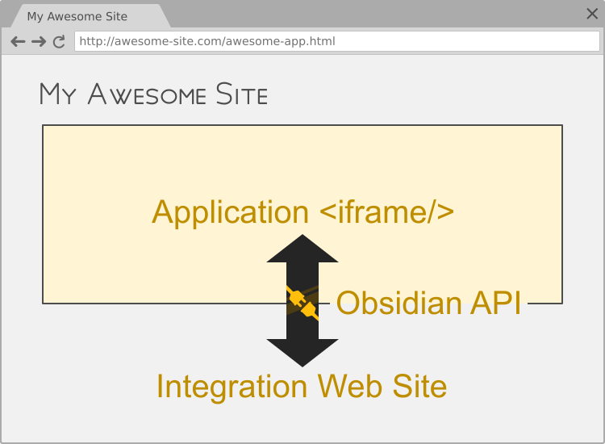

# Obsidian API

**Obsidian API** is a library that allows you to implement an API between a web
application running in an `iframe` and the web page that integrates it.

**Obsidian API is composed of two parts:**

* An application-side Class (inside the `iframe`) that will be used to
  implement the API (methods that will be called remotely by the
  integration,...),
* and an integration-side script (outside the `iframe`) that will be used as
  a client for the API. This script is completely generic and can be used to
  connect to any web application that implements an Obsidian API.

**Features:**

* Remote method calls with return value (integration → app → integration),
* Provides callback-based events (app → integration),
* Allows the integration to send some configuration to the application before
  it is loaded,
* Allows to transfer various types of objects (including `TypedArrays`,
  `Blob` and `Buffer`),
* Allows to use both node-like callbacks or promises for asynchronous calls.

## Install

    npm install obsidian-api

## Documentation

Documentation and examples:

* https://wanadev.github.io/obsidian-api/

## Contributing

### Questions

If you have any question, you can:

* [Open an issue on GitHub][gh-issue]
* [Ask on discord][discord]

### Bugs

If you found a bug, please [open an issue on Github][gh-issue] with as much information as possible.

### Pull Requests

Please consider [filing a bug][gh-issue] before starting to work on a new feature. This will allow us to discuss the best way to do it. This is of course not necessary if you just want to fix some typo or small errors in the code.

### Coding Style / Lint

To check coding style, run the following command:

    npx grunt jshint

### Tests

Tu run tests, use the following command:

    npx grunt test

[gh-issue]: https://github.com/wanadev/obsidian-api/issues
[discord]: https://discord.gg/BmUkEdMuFp

## Changelog

* **[NEXT]** (changes on master that have not been released yet):

  * Nothing yet ;)

* **v2.3.0:**

  * feat: Replaced the `global` keyword by `globalThis` (@flozz, #75)

* **v2.2.0:**

  * feat: Replaced the deprecated Q library by native Promises (@jbghoul, #73, #74)

* **v2.1.0:**

  * feat: Allow to set custom attributes on the `<iframe>` HTML element (@flozz, #60)

* **v2.0.0:**

  * feat: Removed dependency to the uuid library. Use browser's secure implementation if available, or a fallback one else (@flozz)
  * feat: Reduced dependency to lodash (@flozz)

    * Replaced calls to lodash.includes() by calls to native (ES2015) String.prototype.includes()
    * Replaced calls to lodash.toArray() by calls to native (ES2015) Array.from()
    * Replaced calls to lodash.keys() by calls to native (ES5) Object.keys()
    * Replaced calls to lodash.tail() by calls to native Array.prototype.slice(1)
    * Replaced calls to lodash.last() by direct acces to array index

  * !misc: Dropped support for non-ES2015+ browsers; you now have to use polyfill if you need to support old browsers (@flozz)

* **v1.0.9:**

  * Updated dependencies (@jbghoul, #31)
  * Replaced deprecated mocha-phantomjs by mocha-headless-chrome to run tests (@jbghoul, #31)

* **v1.0.8:**

  * Import only used lodash functions instead of the whole library (#30)

* **v1.0.7**:

  * Fixes Error unserialization

* **v1.0.6:**

  * Fixes issue when API functions return `null` (#17)

* **v1.0.5:**

  * Updates dependencies

* **v1.0.4:**

  * Documentation

* **v1.0.3:**

  * Updates dependencies

* **v1.0.2:**

  * Fixes Node.js Buffer transfer

* **v1.0.1:**

  * Updates dependencies

* **v1.0.0:**

  * First public release
